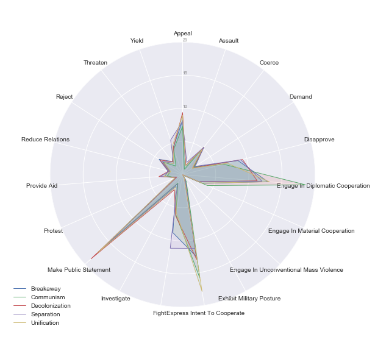

# How to Make or Break a Country

## Why are borders even important? ##
Geographical elements throughout history have had significant influence on the way people behave. Among many natural and human-invented geographical concepts, country borders have evolved to become not only geographical figures, but also political creatures. This makes them likely to bring crucial consequences in domestic and international administrations, all around the world. Although most of the leading experts in this field are currently in a debate about whether state borders are becoming obsolete or even more important in the age of globalization, current state of affairs implies that this topic is becoming even more significant than throughout history.

Using two datasets that in some manner collect information of the important political, economical and social events across the world, this study is trying to showcase the important border changes that occurred in the period after 1979 and the types of events that preceded them.

Even though this may not seem obvious from every day newspapers and TV programs, over the last couple of decades the number of nations on our planet has fluctuated considerably, from 167 widely recognized sovereign states in the 1970s to 195 in this decade. While some nations have unified, the noticeable rise in the number of countries is a product of the separation of pre-existing states. It is important to observe all of the changes that have appeared in these regions in order to better understand the tensions that are now rising in some new localities.

The information shown in our further analysis is primarily based on the data collected as a part of the GDELT (The Global Database of Events, Language, and Tone) project. The idea of this project was to collect the information about important people, locations, organizations, events etc. impacting the public scene from numerous media outlets in over 1000 languages from across every country on the planet.  Its historical archives stretch back to January 1, 1979 and update every 15 minutes.

Additionally, the UCDP External Support Dataset was used to display some of the important international cooperation relations that come to light in the events of border changing. This dataset provides information on the existence, type, and provider of external support for all parties, on an annual basis, between 1975 and 2009.

In the end, none of the datasets offered information about the types and years of border changes throughout the world, so the information from Wikipedia was used to narrow down the observed events in both datasets to only those countries who actually went through some kind of change in territorial integrity. Articles from Wikipedia were also used to help in the process of recognizing the types of border changes.

## Border changes from 1979 to 2017 ##

The map below is supposed to illustrate all of the states that have emerged after some kind of border change after 1. January of 1979. By clicking on some of the “newly-created countries” (the term newly-created might not be appropriate in all of the cases, since some of these countries existed in some point in history, but were part of a unification or occupied for significant periods of time which ended after 1979) you can see the basic information about the selected country. For each country, the popup balloon shows the official new name of the country, the year in which the country emerged and the countries that existed on that territory before border change occurred. Countries are colored according to the type of border change that happened on that territory. 

<iframe width="100%" height="520" frameborder="0" src="https://milenafilipovic.carto.com/builder/9a7d2acb-8b3c-4f25-9db2-66a3c9acd38c/embed" allowfullscreen webkitallowfullscreen mozallowfullscreen oallowfullscreen msallowfullscreen></iframe>

Types of border changes were classified according to the situations that resulted in the alterations of the territorial integrity into:

 * Communist is used to represent the countries that emerged as a result of decomposition of large socialist/communist countries.

 * Decolonization is used to represent the countries that emerged as a result of the last steps of decolonization.

 * Breakaway is used to represent the states that have declared their independence, but are not internationally recognized as sovereign.

 * Separation is used to represent the countries that emerged as a result of political or military conflict, or because they were freed from occupation.

 * Unification is used to represent the countries that emerged as a result of a unification of other previously existing countries.

Some of the countries had more than one border change in the observed period, so they belong to several types, which was marked by separate color in this map. There are also short explanations of the events that led to the independence of countries or their current conditions available at the end of each popup balloon. Even though this map provides an extensive overview of border changes across the world it is important to note that some of the breakaway states could not be represented since they are not considered to be even autonomous regions in their “parent” countries, so their borders are not precisely defined.

## Distribution of events in the affected areas ##

After observing the countries that underwent a border change, it is important to understand all of the public events that preceded and accompanied alterations in territorial integrity. The radar chart below is used to showcase the distribution of the event types in different types of border changes. Different types of border changes are demonstrated in different colors, while different event types are positioned along the circle border.

There are 20 types of events that can occur in the observed countries and they can have different meaning and positive or negative implications. These event types are: Appeal, Assault, Coerce, Consult, Demand, Disapprove, Engage in Diplomatic Cooperation, Engage in Material Cooperation, Engage in Unconventional Mass Violence, Exhibit Military Posture, Express Intent to Cooperate, Fight, Investigate, Make Public Statement, Protest, Provide Aid, Reduce Relations, Reject, Threaten and Yield. What immediately becomes obvious is the fact that the Consult event is the one that happens most often, regardless of the border change type. This event type is so widespread that it makes over 25% of all of the events that happened in the observed period, and makes the understanding of the distribution of other events harder to examine. Because of this fact, we created a new radar chart which again displays the distributions of the event types, just excluding the type Consult.

New version of the radar chart greatly facilitates the recognition of other important event types. Some other event types like Engage in Diplomatic Cooperation, Make Public Statement and Express Intent To Cooperate are again widespread regardless of the border change type. Contrary to these, the most prominent aggressive event type is Fight, which is significantly more common in the border changes that are results of separation or breakaway states. It is nice to see that even in the conditions of border changing, which could have a large effect on the nations that live in the affected regions, countries still gravitate toward more peaceful solutions like consulting and cooperation, rather than engaging in violent altercations. We can conclude that even though types of border changes have very different premises and are sometimes proclaimed with violence, events that precede them have similar distributions. The only potential indicator is the number of events of type Fight that occur in the area before the official border change takes place, since these are commonly followed by the separation or breakaway state which are usually more violent.

Since there is that many types of events that occurred in the countries that faces border changes, it is important to analyze possible correlations that could appear between them. Following heatmap displays Pearson correlation coefficient between different types of events. Observed coefficient can demonstrate both positive and negative correlation (depending on whether the increase of one variable increases or decreases the other variable) and different strengths of the correlation (if the absolute value of the correlation is between 0 and 0.3 the correlation is considered small, between 0.3 and 0.5 – medium, and between 0.5 and 1 – strong). The stronger the hue of the square found on the intersection of two event types is, the stronger the correlation is.

#HEATMAP

Even though many of the event types are completely uncorrelated, some medium and strong correlations can also be observed. The event type Consult is correlated with many other event types, which was likely since it was previously concluded that this is the most common one in the events distribution, so it can happen simultaneously with many other event types. The fact that the strong hue can be observed in the example of correlation of the event type Threaten with event types Demand and Disapprove, can be explained by the fact that many of the events of threatening are accompanied either by the events of demand or disapproval. That stated, it is important to once again state that correlation does not imply causation, since many of the same types could be caused by some external condition that is not represented in the data.

## Enemy of my enemy is my friend ##

As can be seen from previous analysis, many different types of global events accompanied the process of border changing. In order to gain a better perspective of all of the external factors that in some capacity influenced the countries that underwent border changes, it is important to understand the international relations they had in the period of the border changing. Because it would be difficult to make a comparison of all of the relations between almost 200 countries in the world,  it is better to concentrate on specific regions, which will be used as an examples for some of the global phenomena.
Considering those limitations, next part of the analysis is focused on the Balkan region, which was strongly affected by the dissolution of the socialist country of Yugoslavia. Yugoslavia first came into existence after First World War, and consisted of six republics that all became independent countries in the period from 1991 to 2006. The countries did not separate without tensions, and most of them resulted in the armed conflicts of the included nations. The map below is showing the support countries received throughout that period, from the countries involved or just observing the conflicts. The displayed country, which is receiving support from others can be chosen in the upper left corner. Afterwards, the exact year in which the support was registered can be selected, in order to provide the overview of changes in support that occur over time. Each of the countries that provide support are colored and can be clicked which activates the popup balloon that contains relevant information about the support. There were no registered support missions for Slovenia and Montenegro in the observed period, so the only countries that are presented are Serbia, Macedonia, Croatia and Bosnia and Herzegovina.

<iframe width="100%" height="520" frameborder="0" src="https://milenafilipovic.carto.com/builder/97fb000a-697b-45aa-a2f2-c91e11cc5b72/embed" allowfullscreen webkitallowfullscreen mozallowfullscreen oallowfullscreen msallowfullscreen></iframe>

From the map it can be observed that the support was not just limited to the international relations of cooperation, but also that many of the help missions were based on similarities in religion within the population of two countries. Most of the foreign assistance happened in the period from 1992 to 1995 which was marked with the so called “Yugoslav Wars”. It is also important to mention that the dissolution of Yugoslavia still did not end, since there are still many separatist movements across regions of the mentioned countries.

## Africa ##

GBR
<iframe style="display:inline" width="900" height="800" frameborder="0" scrolling="no" src="//plot.ly/~MilenaFilipovic/34.embed"></iframe>

ZWE
<iframe style="display:inline" width="900" height="800" frameborder="0" scrolling="no" src="//plot.ly/~MilenaFilipovic/32.embed"></iframe>

SDN
<iframe width="900" height="800" frameborder="0" scrolling="no" src="//plot.ly/~MilenaFilipovic/30.embed"></iframe>
SSD
<iframe width="900" height="800" frameborder="0" scrolling="no" src="//plot.ly/~MilenaFilipovic/28.embed"></iframe>

SOM
<iframe width="900" height="800" frameborder="0" scrolling="no" src="//plot.ly/~MilenaFilipovic/26.embed"></iframe>

ZAF
<iframe width="900" height="800" frameborder="0" scrolling="no" src="//plot.ly/~MilenaFilipovic/22.embed"></iframe>
NAM
<iframe width="900" height="800" frameborder="0" scrolling="no" src="//plot.ly/~MilenaFilipovic/20.embed"></iframe>

SEN
<iframe width="900" height="800" frameborder="0" scrolling="no" src="//plot.ly/~MilenaFilipovic/24.embed"></iframe>
GAM
<iframe width="900" height="800" frameborder="0" scrolling="no" src="//plot.ly/~MilenaFilipovic/18.embed"></iframe>

ETH
<iframe width="900" height="800" frameborder="0" scrolling="no" src="//plot.ly/~MilenaFilipovic/16.embed"></iframe>
ERI
<iframe width="900" height="800" frameborder="0" scrolling="no" src="//plot.ly/~MilenaFilipovic/14.embed"></iframe>

